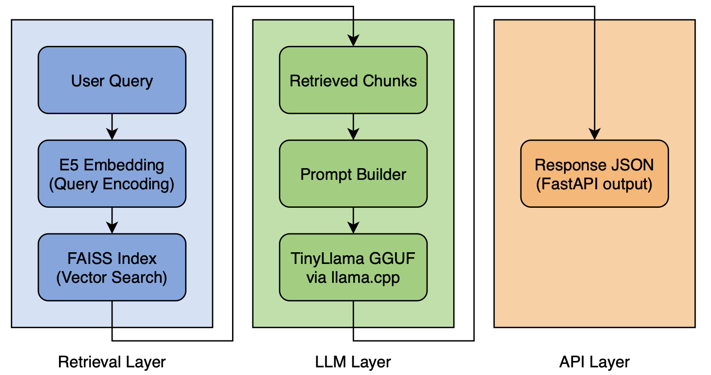
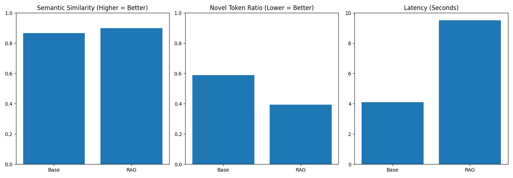

# # Hardware-Aware RAG Evaluation System (Apple M1 Optimized)

## Overview
This project implements and evaluates a Retrieval-Augmented Generation (RAG) pipeline optimized for resource-constrained environments (8GB Apple M1).

The system compares:

- Base LLM
- RAG-enhanced LLM

across hallucination proxy metrics, semantic similarity, and latency trade-offs.

## Architecture

## Tech Stack
- FAISS (Vector Search)
- SentenceTransformers (E5 embeddings)
- Quantized TinyLlama (GGUF via llama.cpp)
- FastAPI backend
- Automated evaluation metrics
- Matplotlib visualization

## Key Results
- RAG improved semantic similarity vs Base LLM
- Reduced novel token ratio (hallucination proxy)
- Introduced ~2.5x latency trade-off
- Optimized for 8GB Apple M1 using quantized inference

## Project Structure
- rag/ → Core RAG pipeline
- evaluation/ → Quantitative evaluation framework
- models/ → GGUF model (ignored in repo)
- vector_store/ → FAISS index (ignored in repo)
- app.py → FastAPI app

## Evaluation Metrics
- Cosine similarity (Answer ↔ Context)
- Token overlap ratio
- Novel token ratio
- End-to-end latency

## How to Run
- python -m rag.build_index
- python -m evaluation.run_evaluation
- python -m evaluation.plot_results
- uvicorn app:app --reload

## Demo

## Comparison

